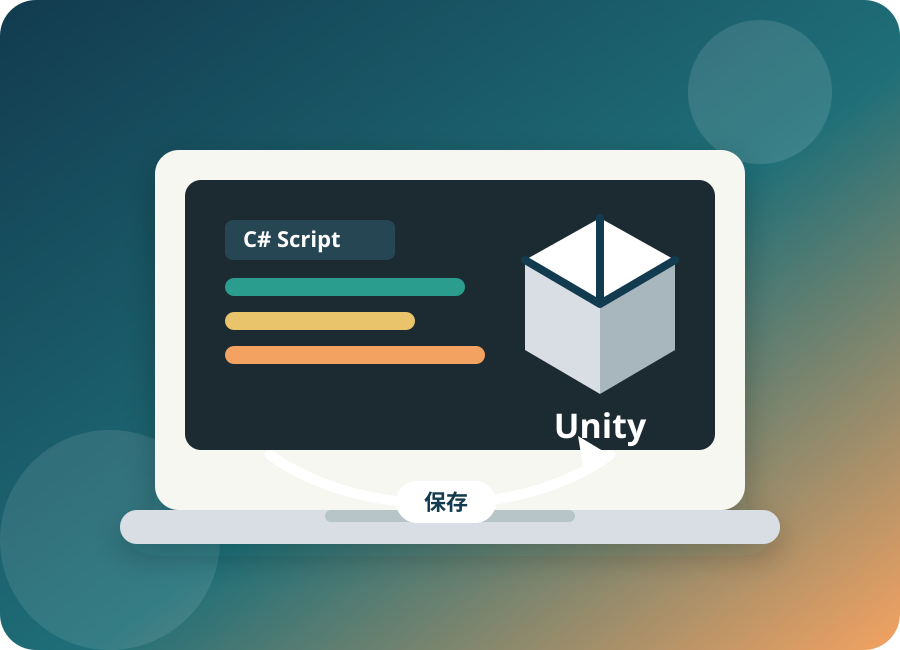
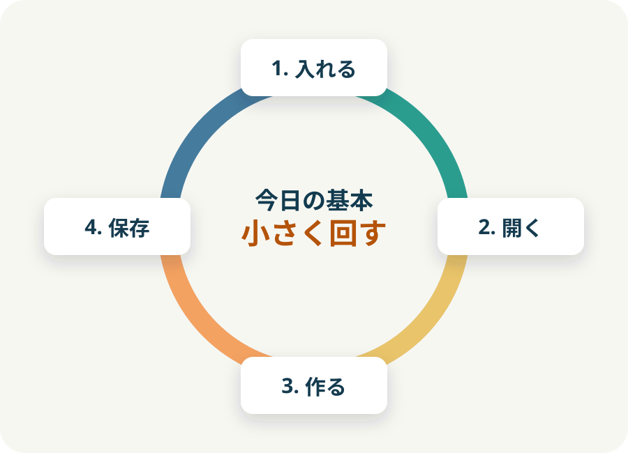
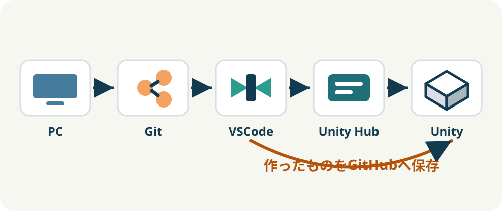
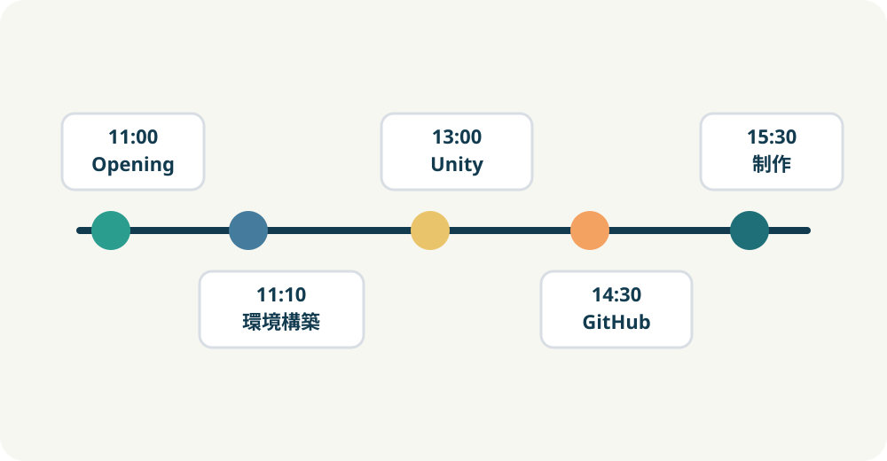
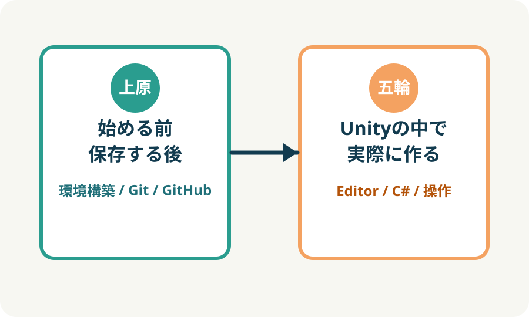
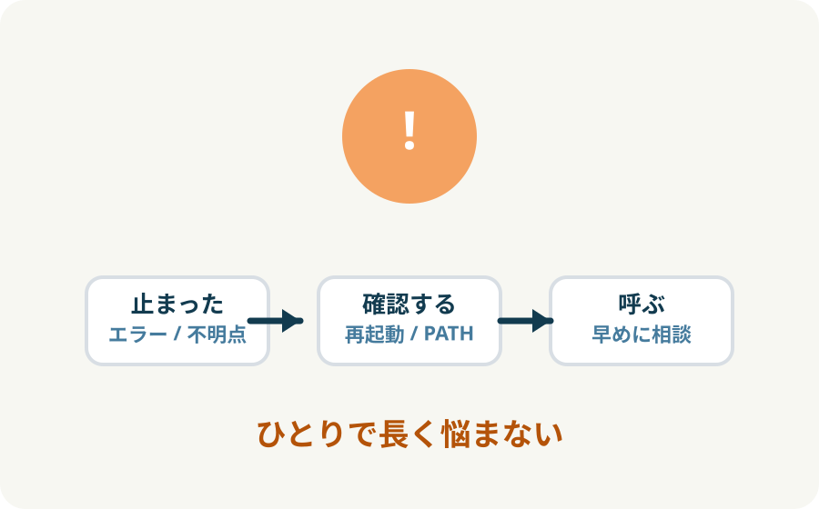
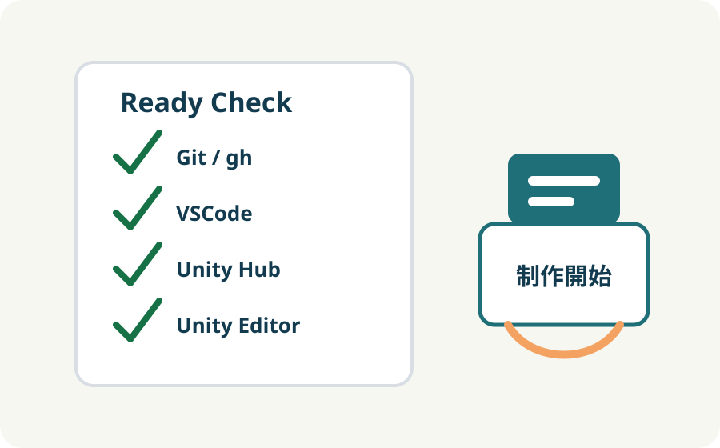
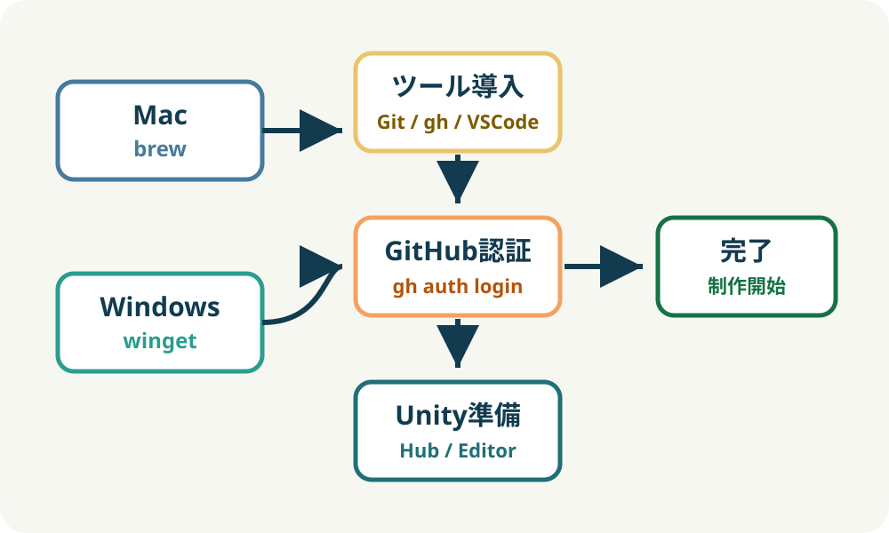

<!-- _class: title -->
<!-- _paginate: false -->

# Unity Sprint 2026

## オープニング

2026年5月8日（金） 11:00-16:00

瀬戸崎研究室

---

# 今日は何をするか

Unityを完璧に理解する日ではありません。

**自分のPCでUnity制作を始められる状態**を作る日です。

- 必要なツールを入れる
- Unityプロジェクトを開く
- 小さく作って動かす
- 作ったものをGitHubに保存する

---

# Unity Sprint 2026とは

情報系の学生・Unity初学者向けの
**Unity / Git / GitHub 入門勉強会**です。

大切にすること:

- まず動かす
- まず作る
- まず保存する
- わからないところはその場で解決する

---

# 今日のゴール

| ゴール | 今日できるようにすること |
| --- | --- |
| 1. 環境構築 | Unity制作に必要なツールを入れる |
| 2. Unity体験 | Editorの基本操作とC#スクリプトを試す |
| 3. GitHub保存 | VSCodeからCommitし、GitHubへSyncする |

---

# 今日の流れ

---

# 今日のプログラム

| 時間 | 内容 | 担当 |
| --- | --- | --- |
| 11:00 - 11:10 | オープニング・全体説明 | 上原 |
| 11:10 - 12:00 | 環境構築 | 上原 |
| 12:00 - 13:00 | 昼休憩 | - |
| 13:00 - 13:40 | Unityの基本説明 | 五輪 |
| 13:40 - 14:30 | C#でスクリプトを書く方法 | 五輪 |
| 14:30 - 15:30 | Git / GitHub 入門 | 上原 |
| 15:30 - 15:50 | オリジナルコンテンツ制作について | 上原・五輪 |
| 15:50 - 16:00 | クロージング | 上原 |

---

# 担当範囲

---

# 今回扱うこと

- Unity開発に必要なツールの導入
- Unity HubとUnity Editorの使い方
- Unityプロジェクトを開く方法
- Unity Editorの基本操作
- C#スクリプトの基本
- Git / GitHubの基本
- VSCodeを使ったGit操作
- 簡単なオリジナルコンテンツ制作

---

# 今回深く扱わないこと

| Git / GitHub | Unity |
| --- | --- |
| コマンド操作の詳細 | 高度なUnity機能 |
| ブランチ運用 | 本格的なゲーム設計 |
| Pull Request | VR / ARの専門的な実装 |
| Merge / Conflict解決 | チーム開発の細かい設計 |
| SSH認証 |  |

必要になったタイミングで、別途扱います。

---

# 今日の進め方

1. **完璧に理解しなくてよい**
   まずは流れを体験する。

2. **詰まったらすぐ呼ぶ**
   環境構築はPCごとの差が出やすい。

3. **小さく作って、こまめに保存する**
   まずは動くものを作り、GitHubに残す。

---

# 困ったら声をかける

- インストールが進まない
- コマンドが実行できない
- エラーが出た
- 何を選べばいいかわからない
- 画面が資料と違う

**止まった時点で呼ぶ**ほうが、全体の進行が速くなります。

---

# 今日の最終状態

- Unity Hubが使える
- Unity Editorがインストールされている
- Unityプロジェクトを開ける
- Unityで簡単な編集ができる
- VSCodeでGitの変更を確認できる
- Commitできる
- GitHubにSyncできる

---

<!-- _class: title -->
<!-- _paginate: false -->

# それでは始めましょう

## まずは環境構築から

自分のPCでUnity制作を始められる状態を作ります。
