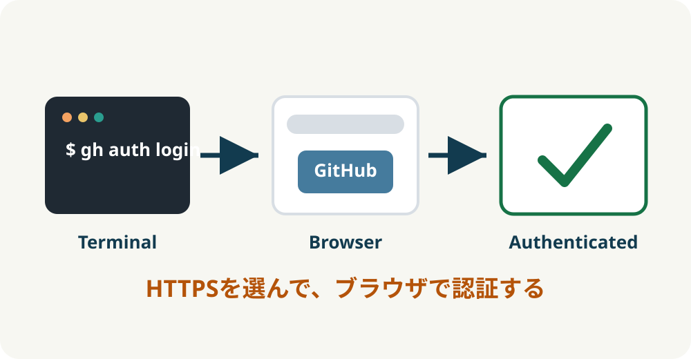
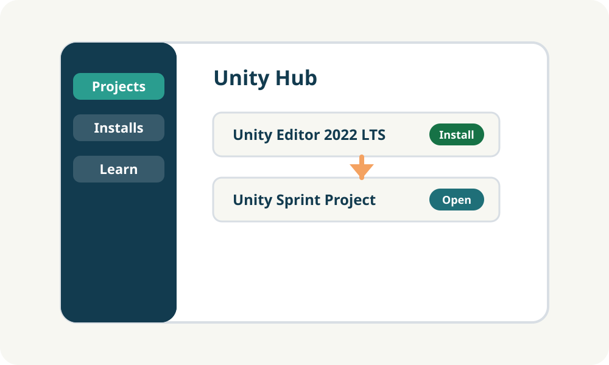

<!-- _class: title -->
<!-- _paginate: false -->


# Environment Setup

## Unity Sprint 2026

Unity制作を始めるための開発環境を作ります。

---

# この資料のゴール


この時間で、次の状態を作ります。

- Gitを使える
- GitHub CLIを使える
- GitHubにログインできる
- Visual Studio Codeを開ける
- Unity Hubを開ける
- Unity Editorをインストールできる
- Unity HubからUnityプロジェクトを開ける

---

# 今日インストールするもの


---

# 作業前チェック

| PC | アカウント・権限 |
| --- | --- |
| Mac / Windows どちらでも可 | GitHubアカウント |
| 空き容量30GB以上を推奨 | Unityアカウント |
| 充電器を接続 | アプリをインストールできる権限 |
| 可能ならマウスを用意 | 安定したインターネット接続 |

---

# セットアップの全体像


---

<!-- _class: title -->
<!-- _paginate: false -->

# Mac向けセットアップ

## Homebrewを使って導入します

---

# Mac 1: ターミナルを開く

Macでは「ターミナル」アプリを開きます。

- Spotlight検索を開く
- `ターミナル` と入力
- ターミナルを起動する

以降のコマンドは、ターミナルに1行ずつ入力します。

---

# Mac 2: Homebrewを確認する

```bash
brew --version
```

バージョン番号が表示されればOKです。

```bash
Homebrew 4.x.x
```

表示されない場合は、Homebrew公式サイトの手順でインストールします。

---

# Mac 3: GitとGitHub CLIを入れる

```bash
brew install git
brew install gh
```

インストール後に確認します。

```bash
git --version
gh --version
```

---

# Mac 4: VSCodeとUnity Hubを入れる

```bash
brew install --cask visual-studio-code
brew install --cask unity-hub
```

確認すること:

- Visual Studio Codeを開ける
- Unity Hubを開ける

---

<!-- _class: title -->
<!-- _paginate: false -->

# Windows向けセットアップ

## wingetを使って導入します

---

# Windows 1: ターミナルを開く

以下のどちらかを開きます。

- Windows Terminal
- PowerShell

可能であれば、管理者権限で開いてください。

以降のコマンドは、ターミナルに1行ずつ入力します。

---

# Windows 2: wingetを確認する

```powershell
winget --version
```

バージョン番号が表示されればOKです。

表示されない場合は、Windowsの状態によって対応が変わります。
講師に相談してください。

---

# Windows 3: GitとGitHub CLIを入れる

```powershell
winget install Git.Git
winget install GitHub.cli
```

インストール後、ターミナルを開き直して確認します。

```powershell
git --version
gh --version
```

---

# Windows 4: VSCodeとUnity Hubを入れる

```powershell
winget install Microsoft.VisualStudioCode
winget install Unity.UnityHub
```

確認すること:

- スタートメニューからVisual Studio Codeを開ける
- スタートメニューからUnity Hubを開ける

---

<!-- _class: title -->
<!-- _paginate: false -->



# GitHub CLIでログイン

## Mac / Windows 共通

---

# GitHubへログインする


```bash
gh auth login
```

質問が出たら、以下の流れで進めます。

```text
GitHub.com
HTTPS
Yes
Login with a web browser
```

---

# 認証の流れ

1. ブラウザが開く
2. GitHubにログインする
3. 表示された認証コードを確認する
4. GitHub CLIの認証を許可する
5. ターミナルに戻る

今回は初学者向けに **HTTPS** を使います。
SSH鍵の作成や登録は、この勉強会では扱いません。

---

# GitHubログイン確認

```bash
gh auth status
```

ログイン済みであることが表示されればOKです。

**ここまでで、GitHubへ保存する準備ができました。**

うまくいかない場合は、講師に相談してください。

---

<!-- _class: title -->
<!-- _paginate: false -->



# Unity Editorを入れる

## Unity Hubから管理します

---

# Unity Hubを起動する


1. Unity Hubを開く
2. Unityアカウントでログインする
3. 必要に応じてライセンスを有効化する
4. `Installs` または `インストール` を開く

画面の表記はバージョンや言語設定で少し変わることがあります。

---

# Unity Editorをインストールする

1. `Install Editor` または `エディターをインストール` を選ぶ
2. 講師が指定するUnity Editorのバージョンを選ぶ
3. 必要なモジュールを選ぶ
4. インストールを開始する

Unity Editorは容量が大きいため、時間がかかります。

---

# Unityプロジェクトを開く

Unity Hubからプロジェクトを開きます。

1. `Projects` または `プロジェクト` を開く
2. `Add` / `Open` / `Create` からプロジェクトを選ぶ
3. 指定されたUnity Editorで開く
4. Unity Editorの画面が表示されるまで待つ

初回起動は時間がかかることがあります。

---

# 完了チェック


- **Git** のバージョンを確認できる
- **GitHub CLI** のバージョンを確認できる
- **GitHub** にログインできている
- **VSCode** を開ける
- **Unity Hub** を開ける
- **Unity Editor** がインストールされている
- Unity HubからUnityプロジェクトを開ける

---

<!-- _class: title -->
<!-- _paginate: false -->


# よくあるトラブル

## 止まったら早めに相談してください

---

# トラブル: 空き容量が足りない

Unity Editorは容量を多く使います。

確認すること:

- 不要なファイルを削除できるか
- ゴミ箱を空にしたか
- 外部ストレージに退避できるか
- 別のPCを使えるか

30GB以上の空き容量を推奨します。

---

# トラブル: コマンドが見つからない

例:

```text
command not found: brew
git is not recognized
gh is not recognized
winget is not recognized
```

確認すること:

- インストールが完了しているか
- ターミナルを開き直したか
- PCを再起動したか
- PATHが通っているか

---

# トラブル: GitHub認証が失敗する

確認すること:

- GitHubアカウントにログインできるか
- ブラウザが開くか
- 認証コードを正しく入力したか
- `HTTPS` を選択しているか

状態確認:

```bash
gh auth status
```

---

# トラブル: Unity Hub / Editor

Unity Hubにログインできない場合:

- メールアドレスとパスワードが正しいか
- ブラウザでUnityにログインできるか
- ネットワークが安定しているか

Unity Editorのインストールが終わらない場合:

- しばらく待つ
- ネットワークを確認する
- 進まなければ講師に相談する

---

<!-- _class: title -->
<!-- _paginate: false -->


# 環境構築完了

## 次はUnity Editorの基本操作へ

作れる状態になったPCで、Unityの画面に触れていきます。
